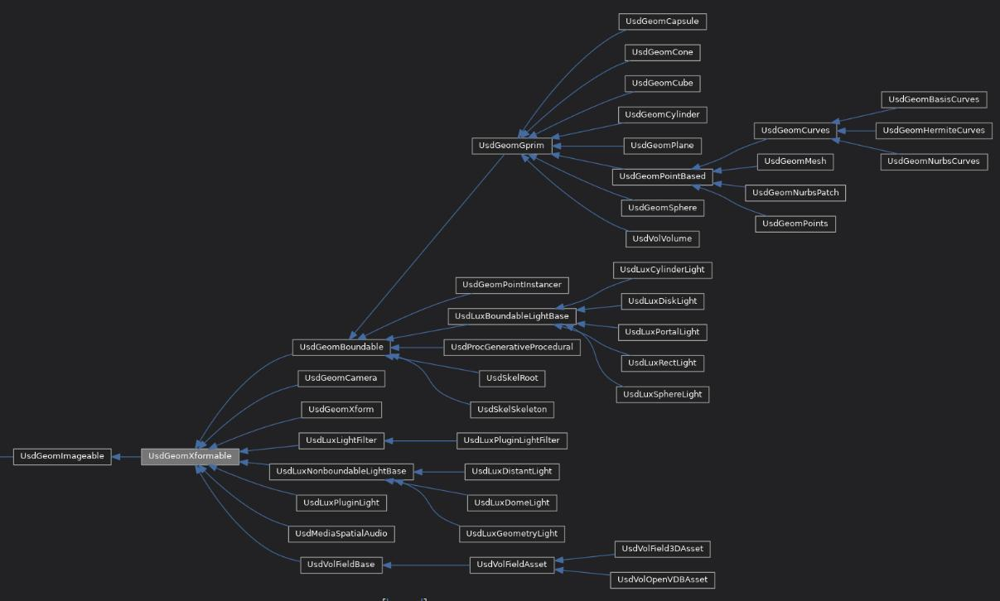

# Transforms
~~~admonish question title="Still under construction!"
This section still needs some more love, we'll likely expand it more in the near future.
~~~

# Table of Contents
1. [Transforms In-A-Nutshell](#summary)
1. [What should I use it for?](#usage)
1. [Resources](#resources)
1. [Overview](#overview)
    1. [Creating and animating transforms](#xformCreate)
    2. [Ignoring parent transforms by resetting the xform stack](#xformResetXformStack)
    1. [Querying transforms](#xformQuery)
1. [Transforms in production](#xformProduction):
    1. [Merging hierarchy transforms](#xformWorldSpaceToLocalSpace)
    1. [Baking transforms for constraint like behaviour](#xformBake)
    1. [Reading Xforms in Shaders](xformCoordinate)

## TL;DR - Transforms In-A-Nutshell <a name="summary"></a>
Transforms are encoded via the following naming scheme and attributes:
- **xformOpOrder**: This (non-animatable) attribute controls what **xformOp:** namespaced attributes affect the prims local space transform.
- **xfromOp:**: Xform ops are namespaced with this namespace and can be considered by the "xformOpOrder" attribute. We can add any number of xform ops for xformable prims, the final world transform is then computed based on a prims local transform and that of all its ancestors.

## What should I use it for? <a name="usage"></a>
~~~admonish tip
We rarely write the initial transforms ourselves, this is something our DCCs excel at. We do query transforms though for different scenarios:
- We can bake down the transform to a single prim. This can then be referenced or inherited and used as a parent constraint like mechanism.
- When merging hierarchies, we often want to preserve the world transform of leaf prims. Let's say we have two stages: We can simply get the parent xform of stage A and then apply it in inverse to our leaf prim in stage B. That way the leaf prim in stage B is now in local space and merging the stages returns the expected result. We show an example of this below.
~~~

## Resources <a name="resources"></a>
- [UsdGeom Xforms](https://openusd.org/dev/api/usd_geom_page_front.html)
- [UsdGeom.Xformable](https://openusd.org/dev/api/class_usd_geom_xformable.html)
- [UsdGeom.XformCommonAPI](https://openusd.org/dev/api/class_usd_geom_xform_common_a_p_i.html)

## Overview <a name="overview"></a>
Creating xforms is usually handled by our DCCS. Let's go over the basics how USD encodes them to understand what we are working with.

### Creating and animating transforms <a name="xformCreate"></a>
USD evaluates xform attributes on all sub types of the xformable schema.



Transforms are encoded via the following naming scheme and attributes:
- **xformOpOrder**: This (non-animatable) attribute controls what **xformOp:** namespaced attributes affect the prims local space transform.
- **xfromOp:**: Xform ops are namespaced with this namespace and can be considered by the "xformOpOrder" attribute.
    - We can add any number of xform ops to xformable prims.
    - Any xform op can be suffixed with a custom name, e.g. xformOp:translate:myCoolTranslate
    - Available xform Ops are:
        - xformOp:translate
        - xformOp:orient
        - xformOp:rotateXYZ, xformOp:rotateXZY, xformOp:rotateYXZ, xformOp:rotateYZX, xformOp:rotateZXY, xformOp:rotateZYX
        - xformOp:rotateX, xformOp:rotateY, xformOp:rotateZ
        - xformOp:scale
        - xformOp:transform

The final world transform is computed based on a prims local transform and that of all its ancestors.

~~~admonish info title=""
```python
{{#include ../../../../code/core/elements.py:xformXformableOverview}}
```
~~~

Here is the snippet in action:

<video width="100%" height="100%" controls autoplay muted loop>
  <source src="./xformCreation.mp4" type="video/mp4" alt="Houdini Xform Creation">
</video>

### Ignoring parent transforms by resetting the xform stack <a name="xformResetXformStack"></a>
We can also set the special '!resetXformStack!' value in our "xformOpOrder" attribute to reset the transform stack. This means all parent transforms will be ignored, as well as any attribute before the '!resetXformStack!' in the xformOp order list.

~~~admonish danger title=""
Resetting the xform stack is often not the right way to go, as we loose any parent hierarchy updates. We also have to make sure that we write our reset-ed xform with the correct sub-frame time samples, so that motion blur works correctly.

This should only be used as a last resort to enforce a prim to have a specific transform. We should rather re-write leaf prim xform in local space, see [Merging hierarchy transforms](#xformWorldSpaceToLocalSpace) for more info.
~~~

~~~admonish info title=""
```python
{{#include ../../../../code/core/elements.py:xformResetXformStack}}
```
~~~

<video width="100%" height="100%" controls autoplay muted loop>
  <source src="./xformResetXformStack.mp4" type="video/mp4" alt="Houdini Xform Stack Reset">
</video>

### Querying transforms<a name="xformQuery"></a>
We can query xforms via `UsdGeom.Xformable` API or via the `UsdGeom.XformCache` cache.

The preferred way should always be the xform cache, as it re-uses ancestor xforms in its cache, when querying nested xforms. Only when querying a single leaf transform, we should go with the Xformable API.

~~~admonish info title=""
```python
{{#include ../../../../code/core/elements.py:xformCache}}
```
~~~

## Transforms in production <a name="xformProduction"></a>
Let's have a look at some production related xform setups.

### Merging hierarchy transforms <a name="xformWorldSpaceLocalSpace"></a>
In production we often need to merge different layers with different transforms at different hierarchy levels. For example when we have a cache in world space and we want to merge it into an existing hierarchy.

Here's how we can achieve that (This example is a bit abstract, we'll add something more visual in the near future).

~~~admonish info title=""
```python
{{#include ../../../../code/core/elements.py:xformWorldSpaceLocalSpace}}
```
~~~

<video width="100%" height="100%" controls autoplay muted loop>
  <source src="./xformWorldSpaceLocalSpace.mp4" type="video/mp4" alt="Houdini Xform Localize Xform">
</video>

### Baking transforms for constraint like behavior <a name="xformBake"></a>
If we want a parent constraint like behavior, we have to bake down the transform to a single prim. We can then inherit/internal reference/specialize this xform to "parent constrain" something.

~~~admonish info title=""
```python
{{#include ../../../../code/core/elements.py:xformBake}}
```
~~~

<video width="100%" height="100%" controls autoplay muted loop>
  <source src="./xformBake.mp4" type="video/mp4" alt="Houdini Xform Localize Xform">
</video>


### Reading Xforms in Shaders <a name="xformCoordinate"></a>
~~~admonish question title="Still under construction!"
We'll add code examples in the future.
~~~

To read composed xforms in shaders, USD ships with the [Coordinate Systems](https://openusd.org/release/wp_coordsys.html) mechanism.

It allows us to add a relationship on prims, that targets to an xform prim. This xform can then be queried in shaders e.g. for projections or other transform related needs. 

See these links for more information:
[UsdShade.CoordSys](https://openusd.org/dev/api/class_usd_shade_coord_sys_a_p_i.html)
[Houdini CoordSys in Shaders](https://www.sidefx.com/docs/houdini/nodes/lop/coordsys.html)
