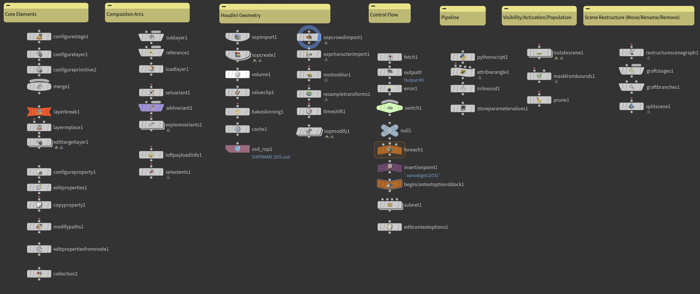
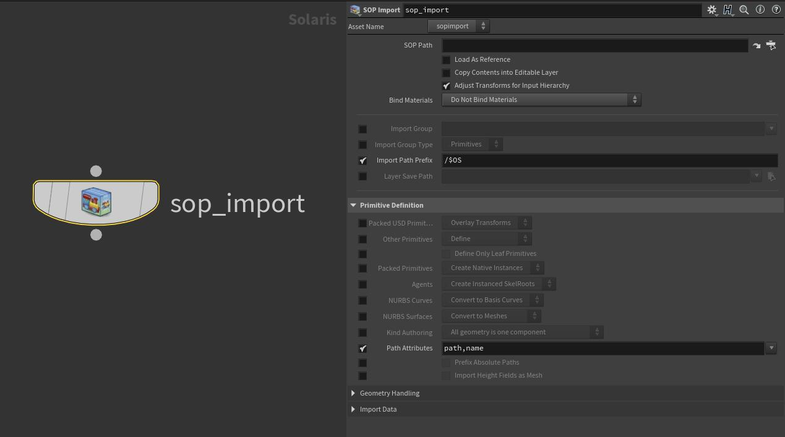
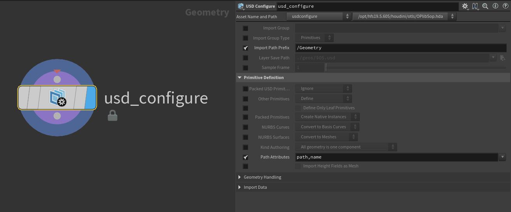

# General Approach
~~~admonish question title="Still under construction!"
We'll likely expand our Houdini section in the future with topics such as:
- lighting
- rendering (render products/render vars (USD speak for AOVs)/render procedurals)
- asset/shot templates
~~~

This page will focus on the basics of what you need to know before getting started in LOPs.

Currently this is limited to LOPs basics and SOP geometry importing/exporting, we'll expand this in the future to other topics.

# Table of contents
1. [Houdini LOPs In-A-Nutshell](#summary)
1. [What should I use it for?](#usage)
1. [Resources](#resources)
1. [Overview](#overview)
1. [Path Structure](#path)
1. [How to convert between LOPs and SOPs](#IO)
    1. [Importing from LOPs to SOPs](#IOLopsToSops)
    1. [Exporting from SOPs to LOPs](#IOSopsToLops)
    1. [Stage/Layer Metrics](#IOLayerMetrics)
1. [Composition]
    1. [Asset Resolver](#compositionAssetResolver)
    1. [Creating Composition Arcs](#compositionAssetResolver)

## TL;DR - <Topic> In-A-Nutshell 
- Main points to know

## What should I use it for? 
~~~admonish tip
Summarize actual production relevance.
~~~

## Resources 
- [API Docs]()
- [Solaris Performance](https://www.sidefx.com/docs/houdini/solaris/performance.html)

## Overview 
<video width="100%" height="100%" controls autoplay muted loop>
  <source src="./houdiniNodeCategories.mp4" type="video/mp4" alt="Houdini Node Categories">
</video>

You can find all the examples we take a look at in our [USD Survival Guide - GitHub Repository](https://github.com/LucaScheller/VFX-UsdSurvivalGuide/blob/main/files/dcc/houdini)

We have a lot of really cool nodes available for us what ship natively with Houdini. Quite a few of them are actually bare-bone wrappers around USD API commands, so that we don't have to master the API to use them.

Now for pipeline developers, these are the nodes you'll primarily be interacting with:

You favorite node will be the Python LOP node, as we have exposure to the full USD API and can modify the stage to our needs.

Ready!?! Let's goooooooo!

## Path Structure 
As covered in our [composition section](../../core/composition/overview.md), composition arcs are centered around loading a specific prim (and its children) in the hierarchy. We usually group our path structure around an "root" prim. That way we can load/unload a specific hierarchy selection effectively. With value clips (USD speak for per frame/chunk file loading) we also need to target a specific root prim, so that we can keep the hierarchy reference/payloadable and instanceable.

As pipeline developers, we therefore should make it as convenient as possible for artists to not have to worry about these "root" prims.

We have two options:
- We give artists the option to not be specific about these "root" prims. Everything that doesn't have one in its name, will then be grouped under a generic "/root" prim (or whatever we define as a "Import Path Prefix" on our import configure nodes). 
- We enforce to always have these root prims in our path. This looses the flexibility a bit, but makes our node network easier to read as we always deal with absolute(s, like the Sith) prim paths.

When working in SOPs, we don't have sidecar metadata per path segment (prim) as in LOPs, therefore we need to define a naming convention upfront, where we can detect just based on the path, if a root is defined or not. There is currently now industry standard (yet), but it might be coming sooner than we might think! Say goodbye to vendor specific asset structures, say hello to globally usable assets.

As also mentioned in our composition section, this means that only prims under the root prims can have data (as the structure above is not payloaded/referenced). Everything we do in SOPs, affects only the leaf prims in world space. So we are all good on that side.

## How to convert between LOPs and SOPs 
To handle the SOPs to LOPs conversion we can either configure the import settings on the LOPs sop import node or we can use the SOPs USD configure node, which sets the exact same settings, but as detail attributes. For pipeline tools, we recommend using the SOPs detail attributes, as we can dynamically change them depending on what we need.

| LOPs Sop Import                                  | SOPs USD Configure Name                            |
|--------------------------------------------------|----------------------------------------------------|
|  |  |

We strongly recommend reading the official docs [Importing SOP geometry into USD](https://www.sidefx.com/docs/houdini/solaris/sop_import.html) as supplementary reading material.

In our [Basic Building Blocks of Usd](../../core/elements/overview.md) section, the first thing we covered was how to handle paths.
Before we look at our import/export nodes let's do the same for Houdini.

In Houdini we can define what attributes Houdini consults for defining the `Sdf.Path` for our prims. By default it is the `path` and `name` attribute. When looking up the path, it looks through the path attributes in the order we define on the sop import/USD configure node. If the value is empty it moves onto the next attribute. If it doesn't find a valid value, it will fallback to defaults (`<typeName>_<idx>`, e.g. "mesh_0").

We can also specify relative paths. These are any paths, that don't start with `/`. These will be prefixed with the prefix defined via the "Import Path Prefix" parm on either ones of the configure nodes.

~~~admonish tip title="Houdini | SOPs to LOPs Path | Evaluation Order"
1. Check what "path" attribute names to consult
1. Check (in order) if the attribute exists and has a non-empty value
1. If the value is relative (starts with "./some/Path", "some/Path", "somePath", so no `/`), prefix the path with the setting defined in "Import Path Prefix" (unless it is a point instance prototype/volume grid path, see exceptions below).
1. If no value is found, use a fallback value with the `<typeName>_<idx>` syntax.
~~~

When working with packed prims (or nested levels of packed prims), the relative paths are anchored to the parent packed level for the nested levels. The top level packed prim is then anchored as usual against the import settings prefix.

For example:
1. Packed: "/level_0"
    1. Packed: "./level_1"
        1. Mesh: "myCoolMesh"

The resulting path will be "/level_0/level_1/myCoolMesh". Be careful, using "../../../myPath" works too, strongly **not** recommended as it breaks out of the path (like a cd ../../path/to/other/folder)!

~~~admonish danger title="Important | Paths and Packed Prims"
When working with paths in SOPs and packed prims, we have to set the path before we pack the geometry. We can't adjust it afterwards, without unpacking the geometry. If we define absolute paths within packed geometry, they will not be relative to the parent packed level. This can cause unwanted behaviours (as your hierarchy "breaks" out of its packed level). We therefore recommend not having absolute paths inside packed prims.

We can easily enforce this, by renaming our "outside" packed attributes to something else and using these as "path" import attributes. That way the inside get's the fallback behavior, unless explicitly set to our "outer" path attributes.
~~~

There are two special path attributes, that cause a different behavior for the relative path anchoring.
- **usdvolumesavepath**: This defines the path of your "Volume" prim. As for volumes we usually use the "name" attribute to drive the volume grid/field name, this gives us "/my/cool/explosionVolume/density", "/my/cool/explosionVolume/heat", etc, as long as we don't define another path attribute that starts with "/". So this gives us a convenient way to define volumes with (VDB) grids.
- **usdinstancerpath**: This defines the path of your "PointInstancer" prim (when exporting packed prims as point instancers). When we define a relative path, it is anchored under "/my/cool/debrisInstancer/Prototypes/ourRelativePathValue". Collecting our prototypes under the "/Prototypes" prim is a common USD practice, as it visually is clear where the data is coming as well as it make the hierarchy "transportable" as we don't point to random other prims, that might be unloaded.

When these two attributes are active, our path attributes that are relative, are anchored differently:
- **usdvolumesavepath**: "/my/cool/explosionVolume/**relativePathValue**".
- **usdinstancerpath**: "/my/cool/debrisInstancer/Prototypes/**relativePathValue**"

Here's a video showing all variations, you can find the file, as mentioned above, in our GitHub repo:

<video width="100%" height="100%" controls autoplay muted loop>
  <source src="./houdiniPathAbsoluteVsRelative.mp4" type="video/mp4" alt="Houdini Node Path">
</video>

### Importing from LOPs to SOPs 

### Exporting from SOPs to LOPs 
~~~admonish tip title="Pro Tip | Working Against Stages"
When working LOPs, we like to use the terminology: "We are working against a stage."

What do we mean with that? When importing from or editing our stage, we are always making the edits relative to our current stage.
When importing to SOPs, we can go out of sync, if our SOP network intermediate-caches geometry. For example if it writes SOP imported geometry to a .bgeo.sc cache and the hierarchy changes in LOPs, you SOPs network will not get the correct hierarchy until it is re-cached.

This can start being an issue, when you want to "over" the data from SOPs onto an existing hierarchy. Therefore we should always try to write our caches "against a stage". Instead of just caching our USD to disk and then composition arcing it into our "main" node stream.

This means that we can validate our hierarchy and read stage metrics like shutter sample count or local space transforms on USD export.
This ensures that the resulting cache is valid enough to work downstream in our pipeline. 
~~~

### Stage/Layer Metrics 
